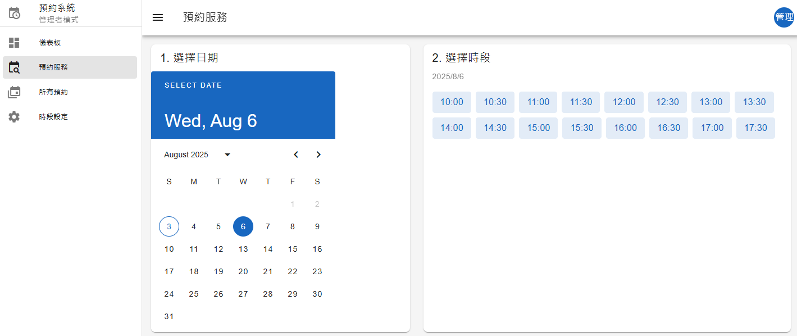

# Vue 3 + Vuetify 3 預約服務系統

這是一個使用 Vue 3、Vuetify 3、Pinia 和 Vue Router 打造的全功能預約服務應用程式。專案完整模擬了真實世界的商業邏輯，包含使用者認證、雙重角色權限系統（管理者與客戶）、動態時段設定與預約等功能。

---

## 線上預覽 (Live Demo)

您可以透過以下連結，直接在線上操作這個專案：

**[點擊這裡前往線上預覽](https://raellen.github.io/vue-booking/)**

* **管理者帳號**: `admin@example.com`
* **客戶帳號**: `mary@example.com` 或 `ming@example.com`
* **密碼**: 可任意輸入

---

## 主要功能 (Features)

### 通用功能
* **使用者認證**: 完整的登入、登出流程，並透過路由守衛保護特定頁面。
* **響應式佈局 (RWD)**: 在桌面、平板和手機上都有良好的視覺與操作體驗。
* **儀表板 (Dashboard)**: 根據登入角色（管理者/客戶）顯示不同的摘要資訊和快捷操作入口。

### 管理者 (Admin) 功能
* **時段設定**: 可視化設定每週一至週日，每日的「可預約時段」（例如：週一 09:00 - 17:00）。
* **所有預約總覽**: 以表格形式查看系統中所有的預約紀錄，並支援分頁、排序與搜尋功能。
* **數據摘要**: 在儀表板快速查看總預約數與待處理預約數。

### 客戶 (Client) 功能
* **預約服務**:
    * 透過日曆選擇日期。
    * 系統會根據管理者設定的時段，動態計算出當天所有可預約的時間。
    * 已被預約的時段將自動標示為不可選。
* **我的預約**: 查看自己所有已成功的預約列表，並可取消預約。
* **儀表板**: 快速查看下一個即將到來的預約時間。

---

## 技術棧 (Technology Stack)

* **核心框架**: [Vue 3](https://vuejs.org/) (使用 Composition API & `<script setup>`)
* **UI 框架**: [Vuetify 3](https://vuetifyjs.com/)
* **專案建構**: [Vite](https://vitejs.dev/)
* **狀態管理**: [Pinia](https://pinia.vuejs.org/)
* **路由**: [Vue Router](https://router.vuejs.org/)
* **HTTP 客戶端**: [Axios](https://axios-http.com/)
* **後端模擬**: [json-server](https://github.com/typicode/json-server)
* **程式碼風格**: ESLint & Prettier
